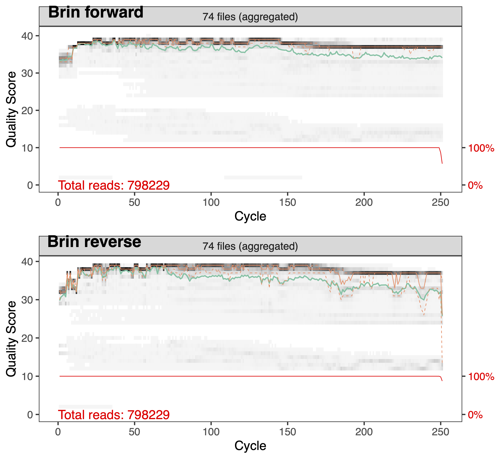

# Traitement des fastqs

DADA2 est un pipeline bio-informatique qui comprend une série d’étapes permettant de filtrer les séquences brutes obtenues par le séquençage d'amplicons. Ultimement, le pipeline permet d'obtenir une matrice d'abondance d'ASVs en fonction des échantillons ainsi que la classification taxonomique des séquences associées aux différents ASVs. 

DADA2 a deux particularités qui le distingue des autres pipeline courament utilisés. D’une part, il procède la à modélisation de l’erreur dûe au séquençage ce qui est censé permettre des distinguer les séquences mutantes, des séquences érronées. D’autre part, contrairement à d’autres pipelines comme QIIME ou Mothur, DADA2 ne regroupe pas les séquences similaires à 97% en Unités Taxonomiques Opérationelles (OTUs). Ses ASVs ne subissent pas de regroupement si les séqences ne sont pas identiques à 100%.

## Pré-analyse

Importer les librairies que nous utilisons pour traiter les données  
```{r, eval=FALSE}
library(tidyr)
library(dplyr)
library(dada2)
library(phyloseq)
library(DECIPHER)
```

Identifier les échantillons présents dans le dossier de travail et extraire le nom de ces deniers sans les artefacts ajoutés lors du séquençage. 
```{r, eval = FALSE}
# Créer une variable qui définit le lien vers le dossier contenant tous les fichiers en format fastq
path = "~/BIO1410/2023/raw_fastqs"  
# Identifier tous les fichiers fastq du brin Forward
fnFs = sort(list.files(path, pattern="_R1_001.fastq", full.names = TRUE)) 
# Identifier tous les fichiers fastq du brin Reverse
fnRs = sort(list.files(path, pattern="_R2_001.fastq", full.names = TRUE)) 
# Extraire le nom de l'échantillon à partir du nom du fichier en assumant 
# que le format du nom de l'échantillon est le suivant : NOM-ÉCHANTILLON_XXX.fastq.gz
sample.names = sapply(strsplit(basename(fnFs), "_"), `[`, 1) 
# Appliquer ce nom sans les artefacts du séquençage à nos variables 
names(fnFs) = sample.names 
names(fnRs) = sample.names
``` 

## Inspecter la qualité, filtrer et rogner

**Inspecter la qualités des séquences** 

Afin d'inspecter la qualité des séquences nous utilisons la commande `plotQualityProfile`. Cette commande représente graphiquement le Q score (axe des Y) associé à chaque nucléotide (axe des X). La médianne est en vert, et les quartiles en orange pointillé. Le Q score est une mesure qui nous renseigne sur la précision du séquençage (voir tableau ci-dessous). 
  
    Q score           Précision
  -----------       ------------- 
    10                    90 %
    20                    99 %
    30                    99.9 % 
    40                    99.9 % 


```{r, warning = FALSE, eval= FALSE}
plotQualityProfile(fnFs, aggregate = TRUE)
plotQualityProfile(fnRs, aggregate = TRUE)
```

```{r echo=FALSE, out.width = "70%", fig.align = "center", out.lenght = "100%"}

```

L’analyse de ces graphiques nous permet donc de choisir les paramètres de filtrage et de rognage de la prochaine étape. La qualité des séquences du brin Forward est généralement de meilleur qualité que celle des séquences du brin Reverse. L'intégralité du brin Forward (250 nucléotides) est d'assez bonnes qualité pour le conserver entier alors que pour le brin Reverse nous supprimerons les nucléotides après la position 240. En observant les graphiques générés, vous pouvesz constater que le début des séquences est aussi de moins bonne qualité et comprend les amorces que nous devons retirer. 

**Filtrer et rogner les séquences** 

Tout d’abord nous créons un dossier `filtered` ainsi que les objets `filtFs` `filtRs` pour stoquer les séquences filtrées.
```{r, eval= FALSE}
filtFs = file.path(path, "filtered", paste0(sample.names, "_F_filt.fastq.gz"))
filtRs = file.path(path, "filtered", paste0(sample.names, "_R_filt.fastq.gz"))

names(filtFs) = sample.names
names(filtRs) = sample.names
```

Nous utilisons la fonction `filterAndTrim` afin de filtrer et rogner les séquences. 

- truncQ : définit un l’indice Q score minimale. A la première instance d’un score de qualité inférieur ou égal à truncQ, la séquence est tronquée.
- truncLen : définit à quelle longueur les séquences vont être tronquées. Les séquences plus courtes que la longueur sont éliminées.
- trimLeft : définit la longueur que l’on coupe du côté 5’ des séquences. Cela permet d’enlever les amorces si elles n'ont pas été préalablement retiré.
  - 799F: AACMGGATTAGATACCCKG = 19 nucléotides / 
  - 1115R: AGGGTTGCGCTCGTTG = 19 nucléotides
- maxEE : définit le nombre maximum d’*erreurs attendues* autorisées dans une lecture. Ce filtre se base sur l’indice Q score. Plus on augmente le chiffre, moins on est strict.

```{r, eval = FALSE}
# Filtrer les séquences 
out = filterAndTrim(fnFs, filtFs, fnRs, filtRs, trimLeft = c(19,16), truncLen=c(250,240), 
                     maxN=0, maxEE=2, truncQ=2,rm.phix=TRUE, 
                     compress=TRUE, multithread=TRUE) 
```

## Retirer les erreurs de nucléotides 

Cet étape consiste à estimer le taux d’erreur de séquençage. Son but est de permettre de différencier les séquences mutantes et les séquences érronées.Le modèle d’erreur est calculé en alternant l’estimation des taux d’erreur et l’inférence de la composition de l’échantillon jusqu’à ce qu’ils convergent vers une solution cohérente.

```{r, eval= FALSE}
errF = learnErrors(filtFs, multithread=TRUE, randomize=TRUE)
errR = learnErrors(filtRs, multithread=TRUE, randomize=TRUE)
```

Nous pouvons maintenant appliquer l'algorithme entraîné sur nos séquences afin de retirer les nulcéotides erronés 
```{r, eval= FALSE}
dadaFs = dada(filtFs, err = errF, pool = "pseudo", multithread=TRUE)
dadaRs = dada(filtRs, err = errR, pool = "pseudo", multithread=TRUE)
```

## Gnérer la matrice d'abondance d'ASVs par échantillon 

Tout l’intérêt du séquençage en paire réside dans le but de fusionner les deux brins afin d’accroitre notre confiance en leur fiabilité. La fusion permet également d’obtenir des amplicons plus long.

```{r, eval= FALSE}
mergers = mergePairs(dadaFs, filtFs, dadaRs, filtRs)
```

Nous avons enfin notre matrice d'abondance d'ASVs que nous allons stoquer dans l’objet seqtab. 
```{r, eval = FALSE} 
# Construire la table d'ASV avec les séquences combinées  
seqtab = makeSequenceTable(mergers)
```

L'étape de retrait des chimère vise à éliminer toutes les séquences non biologiques qui sont produites lorsqu'une séquence n'est pas complètement amplifié lors de la PCR et qu'elle s'hybride avec l'amorce lors du prochain cycle.  
```{r, eval = FALSE}
seqtab.nochim = removeBimeraDenovo(seqtab, method = "consensus", multithread = TRUE)
# Comparer la dimension de la tables d'ASV avec et sans chimières
dim(seqtab.nochim)
sum(seqtab.nochim)/sum(seqtab)
```

## Classification taxonomique

Grâce à l’implémentation de la méthode de classification naïve bayésienne, la fonction `assignTaxonomy` prend en entrée l’ensemble de séquences à classer ainsi qu’un ensemble de séquences de référence avec une taxonomie connue. Nous utilisons la base de données d'amplicons de Silva. 

```{r, eval= FALSE}
taxa = assignTaxonomy(seqtab.nochim, "~/16S_Project/silva_nr99_v138.1_train_set.fa.gz", multithread=TRUE, tryRC=TRUE)

```

Comme nous avons plusieurs ASVs non classifié à différents rangs taxonomique, nous allons venir copier le rang taxonomique supérieur suivant du mot "Unclassified" aux ASVs non-classifiés. 

```{r, eval= FALSE}
taxid = data.frame(t(taxa))
taxid[] = lapply(taxid, as.character)
taxa2 = tidyr::fill(taxid, colnames(taxid),.direction = "down")
taxa2 = sapply(taxa2, function(x){paste0("Unclassified_", x)})
taxid[is.na(taxid)] = taxa2[is.na(taxid)]
taxid = t(taxid)

# Retirer les ASVs n'appartenant pas au domaine des Bactéries 
taxid = subset(as.data.frame(taxid), Kingdom =="Bacteria")
seqtab.nochim = seqtab.nochim[,colnames(seqtab.nochim) %in% rownames(taxid)]
``` 

## Obtenir les séquences d'acides nucléiques (ADN)
Nous voulons conserver la séquences d'ADN correspondant à chacun des ASVs afin de pouvoir ultimement utiliser cette séquences avec la base de données BLAST de NCBI. 

```{r, eval= FALSE}
# Importer le tableau de données des métadonnées 
meta = read.table("/home/kvilleneuve/16S_Project/BIO1410/metadata.csv",sep=",", row.names=1, header=TRUE)
# Combiner la matrice d'aboncance, le tableau de métadonnées et la table de taxonomique dans un object de type phyloseq
ps = phyloseq(otu_table(t(seqtab.nochim), taxa_are_rows=TRUE), tax_table(as.matrix(taxid)), sample_data(meta))
# On 
dna = Biostrings::DNAStringSet(taxa_names(ps))
names(dna) = taxa_names(ps)
ps1 = merge_phyloseq(ps, dna)

taxa_names(ps1) = paste0("ASV", seq(ntaxa(ps1)))
``` 

## Sauvegarder les résultats en format comma seperated value  (csv)
```{r, eval= FALSE}
# La matrice d'anbondance d'ASV par échantillon
write.csv(seqtab.nochim, file = "~/BIO1410/raw_asv.csv")
# Le tableau de classification taxonomique des ASVs
write.csv(taxid, file = "~/BIO1410/raw_sequences.csv")
# Les séquences d'ADN associées à chacun des ASVs
ps1 %>%
      refseq() %>%
      Biostrings::writeXStringSet("~/BIO1410/raw_refseq.fna", append=FALSE,
                                  compress=FALSE, compression_level=NA, format="fasta")
```

## Raréfier 
**Retirer les taxons peu abondant**
Une des raisons pour retirer les taxons peu abondant est de limiter les temps passé à analyser des taxons rarement vus. Cela s'avère généralement une bonne pratique afin de filtrer le "bruit de fond" inutile (taxons qui ne sont en fait que des artefacts du processus de collecte de données). 
Nous élminons ici les taxons dont l'abondance relative est inférieur à 0.005 % tel que recommandé par *Bokulich et al., 2013* 
```{r, eval=FALSE}
# Define threshold for low abundant taxa
minTotRelAbun = 5e-5
# Get total sum for each taxa
x = taxa_sums(ps)
# Identify taxa with a total sum greater than the defined threshold
keepTaxa = (x / sum(x)) > minTotRelAbun
# Filter out from the phyloseq object any taxa not identified in the keepTaxa object
prunedSet = prune_taxa(keepTaxa, ps)
# View how many taxa were removed by sample 
loss_taxa=data.frame(sample_sums(prunedSet), sample_sums(ps), (sample_sums(prunedSet)-sample_sums(ps)))
```

Nous raréfions ensuite au premier nombre de séquence au-dessus de 1000. Dans note cas cela correspond à 1118. 
```{r, eval=FALSE}
# Get dataframe of sequences per sample
sample_size = as.data.frame(sample_sums(prunedSet))
# Filter for the lowest number above 1000 
rare_value = sample_size[which.max((sample_size[,1] >= 1000)/sample_size[,1]),]
# Rarefy to value identified as rare_value
ps_rare = rarefy_even_depth(prunedSet, rare_value, rngseed = 112, replace = FALSE, trimOTUs = TRUE, verbose = TRUE) 
# Confirm rarefaction as a sanity check 
sample_sums(ps_rare)
```

## Sauvegarder les résultats en format comma seperated value  (csv)
```{r, eval = FALSE}
write.csv(as.data.frame(as(tax_table(ps_rare), "matrix")), file = "~/rarefied_taxa.csv")
write.csv(as.data.frame(as(otu_table(ps_rare), "matrix")),file = "~/rarefied_asv.csv")
``` 
